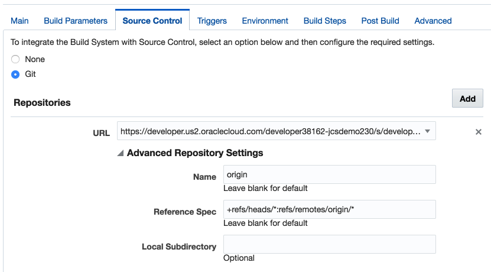

corporatedirectory-jpa
======================

This example replaces the in-memory data structure of the corporatedirectory example with a database using JPA.

Prerequisites
=============

Inputs for this demo are:

1. SSH key for DBCS VM
2. Password for DBCS `system` user
3. Oracle.com SSO user id/password for access to the public Oracle Maven Repository required by the build

Setup Database
--------------

You will need to create an `employee` user with password `employee` in your DBCS PDB.  This user will need rights to create and drop schema.  Once the user is created the application will take care of table creation and population.

Use the `init-dbcs-pdb.sh` script to automate the creation of the user.  Usage is:

    usage: ./init-dbcs-pdb.sh <db user> <db password> <ssh key file> <db server ip> [<PDB name>]

`<db user>` should be `system`.  `<ssh key file>` should be the private key part of the key used when the DBCS instance was created.  `<db server ip>` can be found on the DBCS service instance page.  `<PDB name>` is likely 'PDB1' and the script will default to this value however you may override.

Running the script you should see output similar to:

    $ ./init-dbcs-pdb.sh system ooW_2015 ~/.ssh/labkey 129.152.133.104
    create_user.sh                                     100%  243     0.2KB/s   00:00    
    create_user.sql                                    100%   72     0.1KB/s   00:00    

    SQL*Plus: Release 12.1.0.2.0 Production on Mon Apr 11 18:38:58 2016

    Copyright (c) 1982, 2014, Oracle.  All rights reserved.

    Last Successful login time: Mon Apr 11 2016 18:37:50 +00:00

    Connected to:
    Oracle Database 12c Enterprise Edition Release 12.1.0.2.0 - 64bit Production

    SQL>
    User created.

    SQL>
    Grant succeeded.

    SQL> Disconnected from Oracle Database 12c Enterprise Edition Release 12.1.0.2.0 - 64bit Production
    corporatedirectory-jpa$

When running the init script on a fresh database you'll see some DROP TABLE failures because the script tries to clean up the database if run a second time.  Don't worry about the failure messages the first time you run it.

Encrypt Oracle.com SSO credentials
----------------------------------

This example uses the public Oracle Maven Repository which requires users to accept the terms and conditions and to authenticate when accessed.

To register and accept terms and conditions go to http://www.oracle.com/webapps/maven/register/license.html

Once you have done so you must [use your SSO credentials to access the repository](http://docs.oracle.com/cloud/latest/devcs_common/CSDCS/GUID-2C6E3DAA-E148-4D21-8507-3ECFB99E15C2.htm#CSDCS-GUID-E20C1FB7-FB70-41D9-A664-20387754647B).  This sample provides a utility to get this setup.

1.  Run `setup-mvn-security.sh`
2.  Provide your oracle.com user id
3.  Provide your oracle.com password
4.  The script will generate `settings.xml` and `settings-security.xml` files with your passwords encrypted.

Building the Application
------------------------

To build the application run `build.sh` or manually `mvn -Dsettings.security=mvn/settings-security.xml -s mvn/settings.xml clean package`.

NOTE: the settings.xml references environment variables for a web proxy so you can either provide values for `HTTP_PROXY_HOST` and `NO_PROXY_ALL` (hosts not to proxy) or delete the `<proxy>` element from the file.  You can also remove the `<proxy>` element from the `mvn/settings.template` file to remove the proxy from the generated file.

The output is a zip file in the target folder that is ready to deploy to ACCS.

Running Locally with DBCS
-------------------------

You can test the application locally by setting up an SSH tunnel to the database cloud service DB.

1.  In a terminal window, run `./open-dbcs-ssh-tunnel.sh <ssh key> <db ip address>`.
2.  In another terminal window, run `./run-locally-with-tunnel.sh <id domain>`
3.  Open http://localhost:8080 and the locally running application will connect to the PDB running on the Oracle Cloud.

Building the Application on Developer Cloud Service
---------------------------------------------------

Once you've created the Maven `settings.xml` and `setting-security.xml` files and pushed your project to the DevCS GIT repo you can build on DevCS by configuring the following build steps.

1. Go to the project `Build` tab.
2. Delete the default build that DevCS may have generated (depending on version)
3. Click `New Job` to create a new build
4. Name the new job "CorporateDirectoryBuild" and select `Create a free-style job`.
5. Go to the build's `Main` tab and select `JDK 8` as the JDK to use.
6. Go to the build's `Source Control` tab and select `Git`.

7. Select the project Git repository in the URL drop down.
8. Go to the build's `Triggers` tab and select `Based on SCM polling schedule`.
9. Go to the build's `Build Steps` tab.
10. Click `Add Build Step` and select `Invoke Maven 3`.
11. Set the `Goal` to `-Dsettings.security=mvn/settings-security.xml -s mvn/settings.xml clean package`.  Note the use of the **package** goal--not `install`.

12. Go to the build's `Post Build` tab.
13. Click `Archive the artifacts`.
14. Set the `Files To Archive` to `**/target/*.zip`.
15. Click `Save`.
16. Click `Build Now` to initiate the build.

Creating the Application
------------------------

Because DevCS does not yet support deployment.json in the Deployment Configuration, the application environment needs to be configured prior to initial deployment.  You will create a sample application along with the necessary service binding to DBCS. Run `create-application.sh` from you local machine with your identity domain, user id, and password.

`usage: ./create-application.sh <id domain> <user id> <user password>`

    $./create-application.sh jcsdemo230 demouser demopassword

Once the `CorporateDirectory` application is created you can go to the ACCS service console and review the service binding to your DBCS instance.  Once created your list of environment variables should include something like:

    DBAAS_DEFAULT_CONNECT_DESCRIPTOR 129.191.0.93:1521/PDB1.jcsdemo200.oraclecloud.internal
    DBAAS_USER_NAME employee
    DBAAS_USER_PASSWORD ********
    DBAAS_LISTENER_HOST_NAME 129.191.0.93
    DBAAS_LISTENER_PORT 1521
    DBAAS_DEFAULT_SID ORCL
    DBAAS_DEFAULT_SERVICE_NAME PDB1.jcsdemo200.oraclecloud.internal

The application will read the following environment variables (see EmployeeService.java) to log in:

    DBAAS_DEFAULT_CONNECT_DESCRIPTOR
    DBAAS_USER_NAME
    DBAAS_USER_PASSWORD

Deploying the Application from Developer Cloud Service
------------------------------------------------------

Once you have built the application successfully at least once in DevCS, you can define a deployment configuration to automate deployment to ACCS.

1. Go to the project `Deploy` tab
2. Click `New Configuration`
3. Enter a deployment configuration name, e.g. "CorporateDirectoryDeploy"
4. Enter the application name.  This is the name of the application created by `create-application.sh` script, which is `CorporateDirectory`.
5. Click on the `Deployment Target` field to get a drop down list.  Select your identity domain.
6. For `Type`, select `Automatic`.  This will deploy all successful builds automatically.
7. Select the default build name for the `Job` field.
8. Select the sole zip generated by the build as your `Artifact to deploy`.
9. `Save` the configuration.
10. Once saved, click on the `Gear` menu of the deployment and choose `Redeploy` to deploy the application archive.
11. Choose the last successful build (it should be the default) and click `Deploy`.
**Exploring the Application**

Opening the application will result in a page with a list of employees.  Behind the scenes, the application will create tables and populate them if necessary.  

If you create/edit employees you can see the generated SQL by obtaining and downloading application logs.
